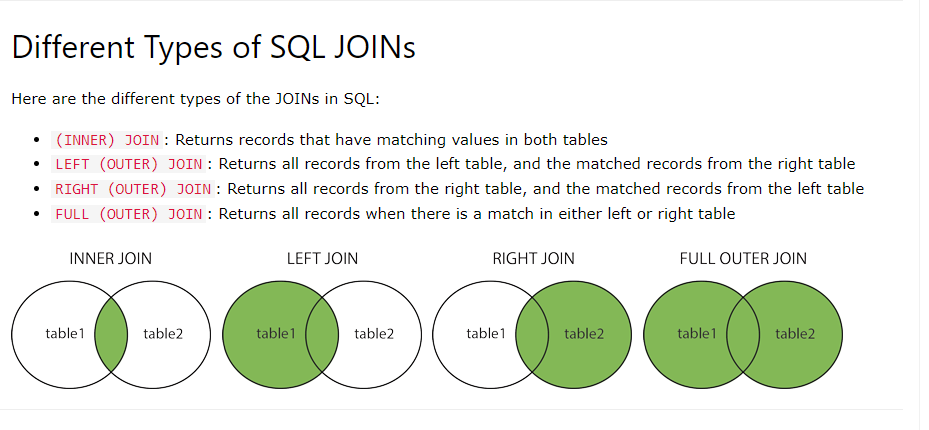

## In SQL, both TRUNCATE and DELETE statements are used to remove data from a table, but they differ in several key aspects:

-   Operation Type:

    - DELETE: The DELETE statement is a DML (Data Manipulation Language) operation. It is used to remove specific rows from a table based on a specified condition. DELETE can be selective, meaning you can delete specific rows based on a WHERE clause.
    - TRUNCATE: The TRUNCATE statement is a DDL (Data Definition Language) operation. It is used to remove all rows from a table without specifying any condition. TRUNCATE is a non-selective operation that removes all data from the table.

-   Logging:

    - DELETE: The DELETE statement is logged, which means that each deleted row generates an entry in the transaction log. This allows for the possibility of rolling back the operation.
    - TRUNCATE: The TRUNCATE statement is minimally logged (or not logged at all in some database systems). It doesn't generate individual log entries for each deleted row. This makes TRUNCATE faster than DELETE when removing all rows.

-   Resetting Auto-Increment Values:

    - DELETE: Deleting rows using DELETE does not reset auto-increment or identity column values. If you delete rows with auto-increment or identity columns, the sequence of values will have gaps.
    - TRUNCATE: When you use TRUNCATE on a table with auto-increment or identity columns, it resets the auto-increment counter to its initial seed value.

## In SQL, the FULL JOIN syntax is not supported directly in all database management systems (DBMS). The SQL standard defines LEFT JOIN, RIGHT JOIN, and INNER JOIN, but it doesn't include a standard FULL JOIN operator.

## What is a Stored Procedure?

-   A stored procedure is a prepared SQL code that you can save, so the code can be reused over and over again.

-   So if you have an SQL query that you write over and over again, save it as a stored procedure, and then just call it to execute it.

-   You can also pass parameters to a stored procedure, so that the stored procedure can act based on the parameter value(s) that is passed.

-   Stored Procedure Syntax

        DELIMITER //

        CREATE PROCEDURE procedure_name(IN input_age INT)
        BEGIN

            /* write as mnay sql statement you want; */

            SELECT * FROM temp WHERE age > input_age;
        END //

        DELIMITER ;

        

-   Execute a Stored Procedure

        call procudere_name(parameter)

-   check available procedure 

        show create procedure procedure_name;

-   drop procedure

        drop procedure if exists procedure_name;

-   check status : 

        SHOW PROCEDURE STATUS LIKE procedure_name;

#### In SQL, a view is a virtual table generated by executing a SELECT query on one or more underlying tables. Views serve as an abstraction layer, simplifying data access and manipulation. They enhance security by allowing fine-grained control over which data columns users can access. Views also aid in query reuse, enabling complex queries to be encapsulated and reused in various parts of an application. While views don't store data themselves, they provide a convenient and consistent interface for querying and managing data. Additionally, they can enhance performance by precomputing results for frequently used calculations or aggregations.

#### SQL injection is a malicious technique where attackers manipulate input in web applications to execute unauthorized SQL queries. When applications fail to validate and sanitize user input, attackers can insert harmful SQL code, potentially leading to data breaches or unauthorized access. To prevent SQL injection, developers should use parameterized queries and input validation, while administrators must secure databases and apply regular updates to protect against this serious security threat.

## fuzzy search

    SELECT word FROM your_table WHERE SOUNDEX('target_word') = SOUNDEX(word);

### Migration in MySQL refers to the process of managing database schema changes over time. It allows developers to version control and apply changes to the database structure, such as adding or modifying tables and columns, in an organized and reproducible way. This ensures that different versions of an application can work with the same database schema.

### Seeders, on the other hand, are scripts or programs used during the migration process to populate database tables with initial data or predefined records. They help ensure that the database starts with necessary data, making it easier to set up and test applications.

### SQL is a language used for managing and querying relational databases. It's a standard for working with data. MySQL, on the other hand, is a specific open-source relational database management system (RDBMS) that uses SQL as its query language. While SQL is a language, MySQL is the software that implements it. Think of SQL as a language like English, and MySQL as a book that uses that language. There are other books (other RDBMSs) that use the same language, such as PostgreSQL and Oracle, but they have their unique features and ways of organizing data.

### The MVC (Model-View-Controller) structure is a software architectural pattern used in application development to separate and organize code into three distinct components: Model, View, and Controller. This separation enhances the maintainability and scalability of software.

-   Model: The Model represents the application's data and business logic. It manages data storage, retrieval, and manipulation. In a database-driven app, the Model communicates with the database and ensures data integrity.

-   View: The View is responsible for the presentation layer, representing the user interface. It displays data to users and handles user interactions. Views are kept as passive as possible, meaning they contain minimal logic and directly reflect the state of the Model.

-   Controller: The Controller acts as an intermediary, managing user input and coordinating communication between the Model and View. It interprets user actions, processes requests, and triggers changes in the Model and View accordingly.

### Library: Think of a library as a collection of specialized tools that you can use for different tasks. For instance, in the context of programming, the Python Standard Library provides a range of functions and modules for various tasks. You choose and use these functions when needed in your code, giving you more flexibility and control.

### Framework: A framework is like a pre-built structure for a specific purpose. Imagine a construction framework for building houses. It comes with blueprints, predefined designs, and materials. You can't change the core structure much, but it speeds up house construction significantly by providing a solid foundation.

### Window functions : - Window functions, also known as windowing or analytical functions, are a category of SQL functions that perform a calculation across a set of rows related to the current row. These functions allow you to work with a "window" or subset of rows within your result set, and they are commonly used for tasks like ranking, aggregation, and calculating running totals. Window functions do not group rows into a single result but return a value for each row based on a specific window or frame of rows.

-   Example : Let's given an emp table : 

-   row_number() : 
        
        select * , row_number() over() as rn from emp;
        

        select * from (select * , row_number() over() as rn from emp) as t where rn%2=0;
        

        select * from (select * , row_number() over(partition by deptname order by id) as rn from emp) as t;

-   rank() : ORDER BY: Specifies the column(s) based on which the ranking will be assigned. Ranks are given based on the sorted order.

        select * , rank() over() as rnk from emp;
        

        select *, rank() over(partition by deptname) as rnk from emp;
        

        select *, rank() over(partition by deptname order by id) as rnk from emp;
        

        select * from (select *, rank() over(partition by deptname order by id) as rnk from emp) as e where rnk<2;
        

        select *, rank() over(partition by deptname order by salary) as sal_rank from emp;

-   dense_rank() : It's same as rank only. the only difference it creates as it will not skip the values for repetitions which is skipped in case of rank.

-   max/min/avg : -

        select *, min(salary) over(partition by deptname order by id) as min_sal from emp;

-   lag/lead() : - It looks behind for each row. we can specify number of rows to look back as well as default value if not having any data to look into.

        select *, lag(salary) over() as prev_sal from emp;

        select *, lag(salary, 2 , 0) over(partition by deptname) as prev_sal from emp;
        

       

        select *, lead(salary, 2 , 0) over(partition by deptname) as prev_sal from emp;

