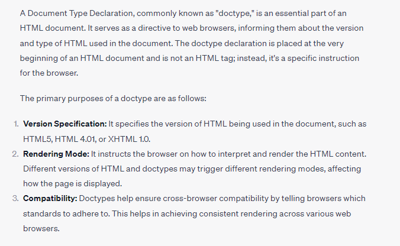
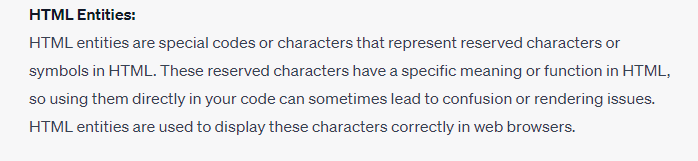
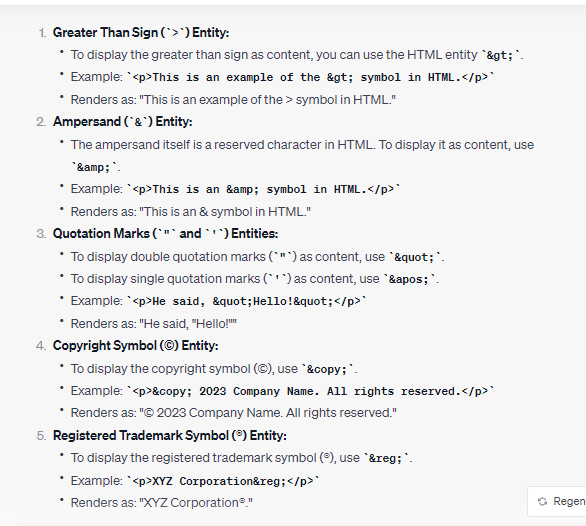

## HTML Interview Questions : - 

## What is DOCTYPE in HTML : 



## HTML Entities : 




### What is the purpose of the HTML colspan and rowspan attributes in table cells?

-   colspan specifies the number of columns a cell should span, and rowspan specifies the number of rows it should span.


### What is BEM?

-   BEM stands for Block, Element, Modifier. It is a naming convention for CSS classes that promotes a more organized and maintainable way to style web components. Blocks are the main components, elements are parts of the blocks, and modifiers are used to modify the appearance or behavior of blocks or elements.


### What is the z-index? What is the stacking context?

-   z-index is a CSS property that controls the stacking order of positioned elements on a web page. Elements with higher z-index values will appear on top of elements with lower values. A stacking context is an element and its descendants that participate in the same stacking context, which determines the stacking order of elements.


### What is polling?

-   Polling is a client-server communication technique where the client repeatedly sends requests to the server at predefined intervals to check for updates or new data. It's often used in scenarios where real-time data is required but WebSockets are not feasible.


### What is long polling?

-    Long polling is a variation of polling where the server holds the client's request open until new data becomes available or a timeout occurs. This reduces the need for frequent polling requests and can be used to achieve near-real-time updates.


### What does the Access-Control-Allow-Origin header do?

-   The Access-Control-Allow-Origin header is part of CORS configuration. It specifies which origins (domains) are allowed to access a particular resource. For example, setting it to "*" allows any domain to access the resource, while specifying a specific domain restricts access to that domain.


### What is clickjacking? How do you fix it?

-   Clickjacking is a security vulnerability where a malicious website can trick a user into clicking on something different from what they perceive. To fix clickjacking, you can implement the **X-Frame-Options** header in your server's HTTP response, which instructs browsers not to render your site within an iframe unless it's from a trusted source.

### What is Progressive Rendering?

-   Progressive rendering is a web design technique where a web page is designed to load and display content incrementally. Instead of waiting for the entire page to load, the browser displays available content as it loads. This gives users a more responsive experience.


### What is the difference between Preloading and Prefetching resources?

-   **Preloading** : Preloading is a technique to request critical resources (e.g., fonts, scripts) early in the page's lifecycle, ensuring they are available when needed. It can improve performance by reducing latency.

-   **Prefetching** : Prefetching is a hint to the browser to fetch resources that will be needed for subsequent navigations. It's used to load resources in the background to speed up future page loads.


### What are service workers?

-  Service workers are a powerful and flexible technology that enables the development of Progressive Web Apps (PWAs) and enhances the performance, reliability, and offline capabilities of web applications. They are a type of JavaScript worker, which means they run in the background, separate from the main web page, and can perform tasks independently. Service workers act as intermediaries between the web application, the browser, and the network, allowing you to control network requests and cache responses.


### Describe the difference between script, script async and script defer.

-   **script**: When you include a script tag without any attributes, the browser will start downloading the script immediately and pause the HTML parsing and rendering process until the script is fully downloaded and executed.

-   This can potentially lead to slower page rendering, especially if the script is large or hosted on a slow server, because other page elements are blocked from loading until the script is ready.

-   It's typically placed in the head section or at the end of the body section of an HTML document.

-   **script async**:

-   The async attribute in the script tag tells the browser to download the script asynchronously, which means it will not block the HTML parsing and rendering process.

-   As soon as the asynchronous script is downloaded, it will execute, potentially before the entire HTML document is parsed.

-   This is useful for scripts that don't rely on the DOM structure of the page and can be executed independently.

-   **script defer**:

-   The defer attribute in the script tag also tells the browser to download the script asynchronously, but with a crucial difference: it will defer the execution of the script until after the HTML parsing is complete but before the DOMContentLoaded event is fired.

-   Multiple scripts with defer will be executed in the order they appear in the HTML document.
This is useful when a script relies on DOM elements or needs to maintain the order of execution relative to other scripts or the page's structure.


# Difference between `innerText` and `textContent`

## 1. Rendering and Hidden Elements
- **`innerText`:**
  - Takes into account styles applied via CSS (e.g., `display: none`, `visibility: hidden`).
  - Returns only the visible text to the user, ignoring hidden elements.
  - Triggers layout calculations (reflows) since it depends on the rendered appearance.

- **`textContent`:**
  - Returns all the text inside an element, including hidden elements.
  - Ignores applied styles that make some text invisible to the user.
  - Does not trigger layout reflows, making it generally faster.

## 2. Whitespace Handling
- **`innerText`:**
  - Collapses consecutive whitespace characters (spaces, tabs, newlines) into a single space, similar to how the text appears on the page.

- **`textContent`:**
  - Preserves all whitespace exactly as it appears in the DOM, including multiple spaces and newlines.

## 3. Performance
- **`innerText`:**
  - Slower due to style computation and page reflowing to determine what’s visible.

- **`textContent`:**
  - Faster, as it reads the content directly from the DOM without affecting layout or triggering reflows.

## Example

```html
<div id="example" style="display:none;">
  Hello   World
</div>
