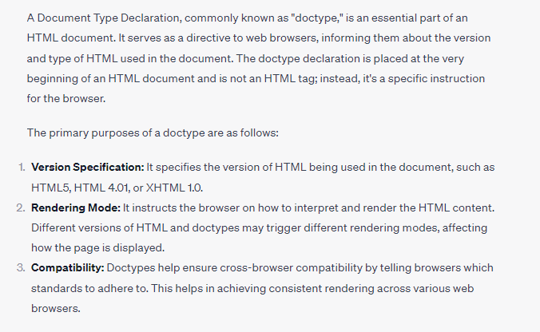
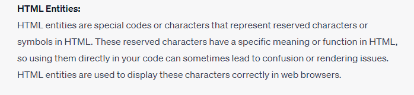
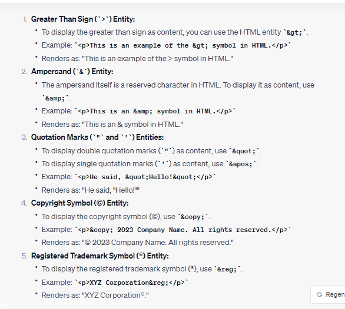

## HTML Interview Questions : - 

## What is DOCTYPE in HTML : 

## HTML Entities : 

### What is the purpose of the HTML colspan and rowspan attributes in table cells?

-   colspan specifies the number of columns a cell should span, and rowspan specifies the number of rows it should span.